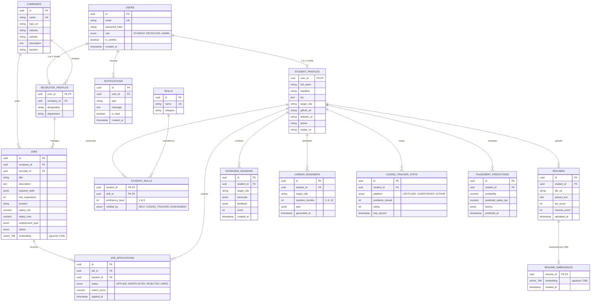

# SkillForge AI — Entity Relationship Diagram

The following Mermaid diagram documents the complete relational and vector database schema for **SkillForge AI**.

```mermaid
erDiagram
    USERS ||--o| STUDENT_PROFILES : "1-to-1 Profile"
    USERS ||--o| RECRUITER_PROFILES : "1-to-1 Profile"
    USERS ||--o{ NOTIFICATIONS : "receives"

    COMPANIES ||--o{ RECRUITER_PROFILES : "employs"
    COMPANIES ||--o{ JOBS : "posts"

    RECRUITER_PROFILES ||--o{ JOBS : "manages"
    JOBS ||--o{ JOB_APPLICATIONS : "receives"

    STUDENT_PROFILES ||--o{ STUDENT_SKILLS : "possesses"
    SKILLS ||--o{ STUDENT_SKILLS : "classified by"

    STUDENT_PROFILES ||--o{ RESUMES : "uploads"
    RESUMES ||--o| RESUME_EMBEDDINGS : "vectorized into (768)"

    STUDENT_PROFILES ||--o{ JOB_APPLICATIONS : "submits"
    STUDENT_PROFILES ||--o{ INTERVIEW_SESSIONS : "conducts"
    STUDENT_PROFILES ||--o{ CAREER_ROADMAPS : "generates"
    STUDENT_PROFILES ||--o{ CODING_TRACKER_STATS : "tracks"
    STUDENT_PROFILES ||--o{ PLACEMENT_PREDICTIONS : "evaluates"

    USERS {
        uuid id PK
        string email UK
        string password_hash
        enum role "STUDENT, RECRUITER, ADMIN"
        boolean is_verified
        timestamp created_at
    }

    STUDENT_PROFILES {
        uuid user_id PK, FK
        string full_name
        string headline
        text bio
        string target_role
        string github_url
        string linkedin_url
        string phone
        string avatar_url
    }

    SKILLS {
        uuid id PK
        string name UK
        string category
    }

    STUDENT_SKILLS {
        uuid student_id PK, FK
        uuid skill_id PK, FK
        int proficiency_level "1 to 5"
        enum verified_by "SELF, CODING_TRACKER, ASSESSMENT"
    }

    COMPANIES {
        uuid id PK
        string name UK
        string logo_url
        string industry
        string website
        text description
        string location
    }

    RECRUITER_PROFILES {
        uuid user_id PK, FK
        uuid company_id FK
        string designation
        string department
    }

    JOBS {
        uuid id PK
        uuid company_id FK
        uuid recruiter_id FK
        string title
        text description
        jsonb required_skills
        int min_experience
        string location
        numeric salary_min
        numeric salary_max
        enum employment_type
        enum status
        vector_768 embedding "pgvector (768)"
    }

    RESUMES {
        uuid id PK
        uuid student_id FK
        string file_url
        text parsed_text
        int ats_score
        int resume_score
        timestamp uploaded_at
    }

    RESUME_EMBEDDINGS {
        uuid resume_id PK, FK
        vector_768 embedding "pgvector (768)"
        timestamp created_at
    }

    JOB_APPLICATIONS {
        uuid id PK
        uuid job_id FK
        uuid student_id FK
        enum status "APPLIED, SHORTLISTED, REJECTED, HIRED"
        numeric match_score
        timestamp applied_at
    }

    INTERVIEW_SESSIONS {
        uuid id PK
        uuid student_id FK
        string target_role
        jsonb transcript
        jsonb feedback
        int score
        timestamp created_at
    }

    CAREER_ROADMAPS {
        uuid id PK
        uuid student_id FK
        string target_role
        int duration_months "3, 6, 12"
        jsonb plan
        timestamp generated_at
    }

    CODING_TRACKER_STATS {
        uuid id PK
        uuid student_id FK
        enum platform "LEETCODE, CODEFORCES, GITHUB"
        int problems_solved
        int rating
        timestamp last_synced
    }

    PLACEMENT_PREDICTIONS {
        uuid id PK
        uuid student_id FK
        numeric probability
        numeric predicted_salary_lpa
        jsonb factors
        timestamp predicted_at
    }

    NOTIFICATIONS {
        uuid id PK
        uuid user_id FK
        string type
        text message
        boolean is_read
        timestamp created_at
    }
```
